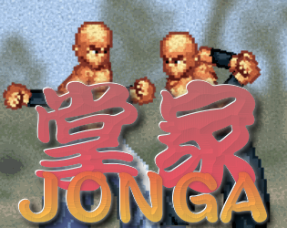

# Jonga

<!--

-->
Physics based kung fu boss battle game!

<!--
Jonga is open source and made for [Mini LD 62](insert link here)

[Play online now](insert link here)
-->

### Licenses

- Code is under MIT (see `LICENSE`)
- Character images derived from [Platformer Base by Miguel Duarte](http://opengameart.org/content/platformer-base) CC BY-SA 3.0
- Logo by 
- Sounds:
  - parry derived from [Weapons & Fighting » Fist Punch 3.mp3 by CGEffex](https://freesound.org/people/CGEffex/sounds/89769/) CC BY 3.0
  - whoosh derived from [heavy cloth rustle.wav by jacobzeier](https://freesound.org/people/jacobzeier/sounds/163164/) CC0
